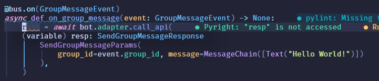

# Bot 对象

!!!warning
	下文中的**OneBot 实现**、**Bot（机器人）**等词均按照 [OneBot 术语表](https://12.onebot.dev/glossary/) 解释。

Bot 对象是你在开发中打交道最多的对象之一。

Bot 对象表示一个**机器人实例**，你通过这个对象来和**OneBot实现**打交道，控制机器人执行操作。

## 创建 Bot 对象

Bot 对象接受的参数如下，其中必填项用**粗体**标识：

| 参数        | 作用                                                         |
| ----------- | ------------------------------------------------------------ |
| **adapter** | 适配器，用于和**OneBot实现**通信。<br />常用的有`ReverseWebsocketAdapter`和`HTTPAdapter`。*目前我们仅实现了 `ReverseWebsocketAdapter`*。 |
| **self_id** | 机器人的Id，定义取决于你使用的OneBot实现。                   |

```python
bus = EventBus()
bot = Bot(
    adapter=ReverseWebsocketAdapter(
        host="127.0.0.1", port=8080, access_token="helloworld", bus=bus
    ),
    self_id=3442852292,
)
```

## 调用 API

你可以通过 `bot.call` 方法来调用任何一个 API。

`bot.call` 接收两个参数，`request` 参数用于构造一个**OneBot 请求**；`response_type` 用于指定返回值的类型，Bot 对象会根据 `response_type` 解析**OneBot 响应**。

!!!note
	得益于 `typing` 库的帮助，`await bot.call(...)` 的返回类型会被 IDE 自动推断 ，因此你可以直接获得 IDE 提供的代码补全和 mypy 等工具提供的类型检查。
	

除此之外，我们在后续版本中也会提供更多常用API的简化版本。