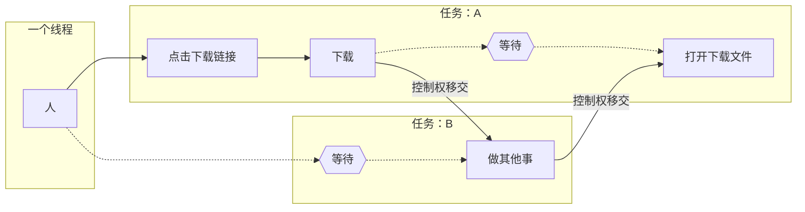

# 异步编程基础

!!!note
	本文参考了 YiriMirai 文档中的[Python 异步教程](https://yiri-mirai.vercel.app/docs/asyncio-tutorial)一章。

## 什么是异步编程

异步编程是一种编程范式，它允许程序在执行某些任务时，不必等待这些任务完成，就可以继续执行其他任务。这种编程方式可以提高程序的执行效率和响应速度，特别是在处理IO密集型或高延迟操作（如网络请求、文件读写等）时。简而言之，异步编程能够让程序在等待某个操作完成的同时，去执行其他操作，从而避免阻塞主线程。

与异步相对的是同步，我们举一个例子：

```python
import time

print('hello')
time.sleep(1)
print('world')
```

任何一个学过Python编程的人都可以看出这段代码的行为：先打印`hello`，等待1s，再打印`world`。

这便是同步编程。同步编程最大的优点是**思路清晰**。**程序永远是从上到下按顺序执行的，不用担心任何意料之外的情况**。

但是，同步也会带来一些性能的浪费。

试想这样一个情景：你在网上下载一个文件，但是文件很大，需要很长时间才能下完。这时候，你肯定不会盯着进度条一点点走，而是去做点别的事情，读一会书，看一会电影，之类的。

但如果有一个完全“同步”的人，<u>他为自己设定的程序是下载这个文件，然后运行它，这样的话，他为了不让自己的运行逻辑乱掉，就会一直守在电脑前，直到文件下载完成才做下一步的工作。</u>用伪代码写出来，就是下面这样子：

```python
# 一个“同步”的人
person.wait_download_file("https://example.com/a_big_file.zip")

person.do_other_works()
```

为了充分利用空闲的时间，我们发明了多线程（Multi-Threading）和回调函数（Callback）。

多线程指的是让计算机同时进行多项工作，例如我们可以在等待文件下载时**让别人帮我们**去做其他事，写成伪代码就是下面这样子：

```python
import threading

threading.Thread(target=person2.do_other_works).start()  # person2 将在后台开始做其他事情
person.wait_download_file("https://example.com/a_big_file.zip")
```

还有一种叫回调函数的技术，可以应用于单线程编程。如果你写过Javascript，我相信你对回调函数有深刻的体会。早期的Web开发者为了防止阻塞Javascript的主线程从而导致用户界面无响应[^1]，便发明了回调函数，例如：

```javascript
fetch('http://example.com/a_big_file.zip')
	.then(function callback(response) {
    	console.log('downloaded')
    	console.log(response)
	})
person.do_other_work()
```

调用`fetch`函数后，其将会**立即**返回一个`Promise`对象。接着，我们调用`Promise`对象的`then`方法，为其设置回调函数，当请求完成后，我们设置的回调函数才会被执行。这样，在等待下载的过程中`person`也可以去做其它的工作了。

但是回调函数也有缺点，当你想在下载完文件之后再发起一个请求告知服务器时，你就必须把代码写成下面这种形式：

```javascript
fetch('http://example.com/a_big_file.zip')
	.then(function callback(response) {
    	fetch('http://example.com/i_downloaded_file')
            .then(function callback2(response2) {
                console.log('ok')
            })
    	console.log('downloaded')
    	console.log(response)
	})
person.do_other_work()
```

你的代码将会一层一层的嵌套下去，导致可读性变得非常差，我们称其为**回调地狱**。

如此看来，异步似乎是一件不太好的事情。多线程给程序的运行平添了一种不可控的随意性，我们不再能看到代码就直接推演出结果，因为即使是相邻书写的僵局代码，之间也可能会有别的代码执行。而回调地狱则会极大降低程序的可读性。

但是**异步相较于同步而言，带来的性能提升实在是太诱人了**。一个网站的服务器，如果是同步的，那么它同时只能让一个用户访问——这简直是不可理喻的事情。

『异步就像几万年前蹲踞在草原清冷的月光下，用锐利的眼神眺望人类营地篝火的一只秀美的狼，而猎手们则思考着如何给它套上项圈，变成自己忠实的猎犬。』—— @Wybxc

所以，多线程的锁、回调，包括协程，这一系列设计，与其说是为了充分利用计算资源，不如说是为了**在人类可理解的范畴内，更好地制服异步**。

## 锁的“困境”

多线程和锁的结合，至今仍然是异步编程的最佳选择之一。因此，怎么加锁、在何处加锁，就成为了一门重要的学问。

锁是个好东西，但是不能有太多。一方面，反复地获取锁释放锁会占用运行时间；另一方面，当一个线程长时间持有某个锁时，其他的线程如果想要访问这个资源，也必须在原地等待，**极端情况下，同一时间只有一个线程在执行！**

人们在优化锁的使用上花了很大功夫，从中衍生出的各种理论此处不再赘述。但是，随着锁越来越多，控制锁的难度会呈指数级上升，最后你90%的时间都是在处理各种锁的交互，只有10%的时间用于开发。Guido（Python之父）解决这个问题的方法很简单——让程序只有一个锁，这个决定的后果就是Python至今没有真正的多线程，**所有的Python 线程都必须等待这个锁，硬生生地让多线程程序几乎退化成了单线程，而且你还必须以多线程的方法去写程序，去考虑资源竞争等问题**。

所以到头来多线程还不如单线程，那我们为什么不用单线程实现异步呢？于是便有了**回调和协程（Coroutine）**两种技术。回调的优点和缺点上文已经介绍过，此处不再赘述。

## 从回调到协程（运行逻辑篇）

协程是现在最主流的实现异步编程的方法，即使是Javascript，也提供了`async/await`语法，把回调封装成了协程的样子。

我们需要先明白，协程并不是**单线程版本的多线程编程**。相反，大多数情况，它是**”多线程“版本的单线程编程**。协程是一个极其伟大的发明，它不但让你可以用单线程编程达到和多线程相似的性能（有时候协程的性能甚至高于多线程），而且不需要考虑各种复杂的”锁“和资源竞争问题。

我们以下面的代码和图为蓝本，简单介绍一下协程的运行逻辑。

```python
import asyncio

async wait_response():  # 返回值是 Coroutine
    ...

class Person:
    async def wait_download_file_async(self, url: str):
        request = preparing_request(url)
        send_request(request)
        coro: Coroutine = wait_response()
        file: Response = await coro  # 这里把控制权移交给 Task B，
        open(file)
       
    async def do_other_works_async(self):
        ...

taskA = person.wait_download_file_async("https://example.com/a_big_file.zip")
taskB = person.do_other_works_async()
await asyncio.wait([taskA, taskB])
```



首先，我们先明确几个概念：

1. 控制权：指程序继续执行的权力，没有控制权的代码只能进行等待。Python中**多线程**的控制权是**抢占式**的，也就是一个任务的控制权可以被强行拿走；**协程**的控制权是**协作式**的，也就是控制权只能由任务自己交出。
2. 等待：指程序暂停执行直到某个操作完成（例如网络通讯）。
3. 异步函数：指通过`async def`定义的函数，其返回值是一个 Coroutine 对象，使用 `await <Coroutine 对象>` 语句取得该函数用 `return` 语句返回的结果。
4. `await <Coroutine 对象>`语句：将控制权交出。

刚开始，这个人点击了下载链接，点击下载链接、准备请求的过程需要计算，因此这一段不能等待，控制权仍然由<u>任务A</u>持有。

当下载开始后，<u>任务A</u>只需要等待服务器将文件的内容发送过来，因此<u>任务A</u>将控制权移交给<u>任务B</u>。[^2]

总之，简单来说就是，<u>当你的异步函数里有`await`语句的时候，该任务停止执行，而其他异步任务可以执行。</u>

## 从回调到协程（实际应用）

上述下载文件的是一个简单的例子，我们来个更复杂的例子——爬虫。

假设我们要从`https://example.com/posts/<id>.html`获取编号从1到500的所有文章，如果用传统的同步语法，则要写成下面这种：

```python
import request
def get_post(id: int):
    return request.get(f'https://example.com/posts/{id}.html')

responses = []
for i in range(1,500+1):
    responses.append(get_post(i))
```

这是很明显的同步写法，无论在任何时候，有且只有一个请求在进行。

下面是异步函数的写法：

```python
import async_request as request
async def get_post(id: int):
    return await request.get(f'https://example.com/posts/{id}.html')

responses = []
for i in range(1,500+1):
    responses.append(await get_post(i))
```

有没有发现哪里不对？

这里我们看似是用异步的方法写了，但在性能上跟同步的写法没有区别，请求还是一个一个的按顺序执行，只不过是原本被`request.get`占据的一部分时间被事件循环占据了。正确的写法是下面这种：

```python
import async_request as request
import asyncio
async def get_post(id: int):
    return await request.get(f'https://example.com/posts/{id}.html')

tasks = []
for i in range(1,500+1):
    tasks.append(asyncio.create_task(get_post(i)))
responses = asyncio.gather(*tasks)
```

这里的`asyncio.create_task`会立即返回一个`Task`对象，而不是像前面的`await get_post(i)`那样等待执行完成才取得结果。

[^1]: Javascript 是一种单线程的编程语言，如果主线程被阻塞，则用户界面也会无响应。
[^2]: 实际上这里是先移交给事件循环，事件循环把控制权移交给需要控制权的程序。

